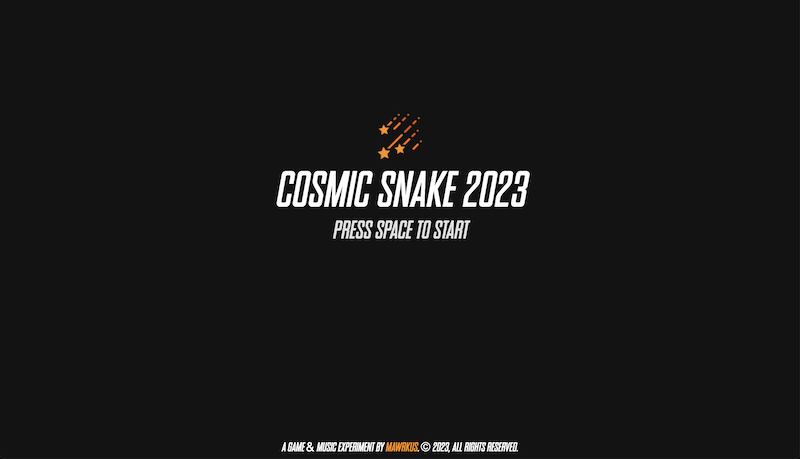
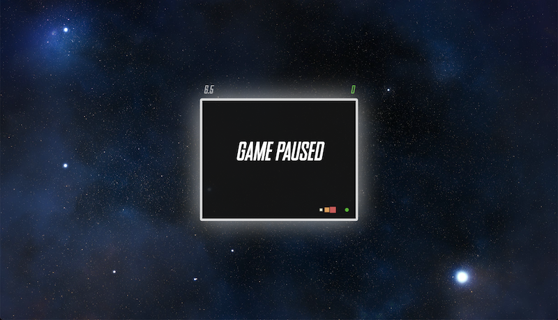
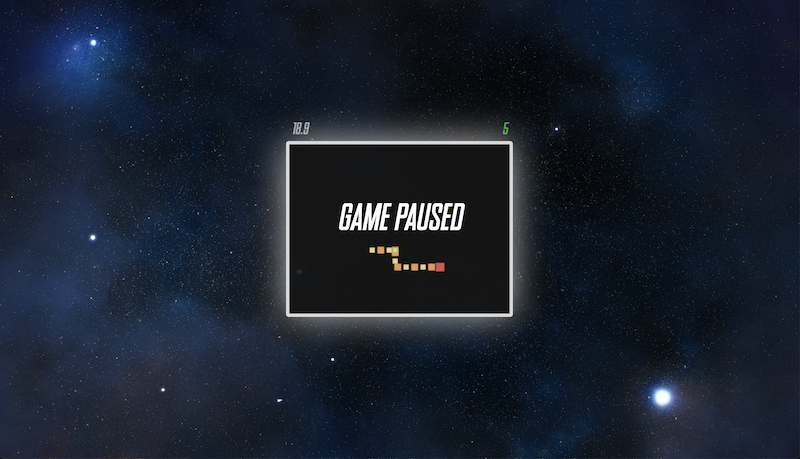

# 🕹️ Game & Music experiment: a Snake video game

A [snake game](https://en.wikipedia.org/wiki/Snake_(video_game_genre)) built with Vanilla JS, HTML and CSS.

A quick note...
> The code is as-it-is: no linter, no tests and, in many places, the inconsistencies of experimenting with several design patterns and strategies to write a video game. The "game-objects" folder is my 1st attempt, the "component-based-entity-system" folder is my 2nd attempt.

## 🚀 Start

```shell
npm i && npm start
```

## 📸 Screenshots





## 🎶 Music

Music composed around 2004 by firestorm aka "tempête de feu", all rights reserved.

## ⛩️ Architecture: core concepts

### Game Objects (1st attempt)

...

### Component-based entity system (2nd attempt)

- [Game Programming Patterns - Component by Bob Nystrom](http://gameprogrammingpatterns.com/component.html)
- [Evolve Your Hierarchy by Mick West](https://cowboyprogramming.com/2007/01/05/evolve-your-heirachy/)
- [Entity Component System FAQ by Sander Mertens](https://github.com/SanderMertens/ecs-faq)

## 💎 Resources

- [Game Programming Patterns, by Bob Nystrom](http://gameprogrammingpatterns.com/contents.html)
- [pixabay - royalty free sound effects for download](https://pixabay.com/sound-effects)
- [TwistedWave - An audio editor in a browser!](https://twistedwave.com/online)
- [icons8 - free icons and more](https://icons8.com/icon/set/gaming/color)
- [SheCodes coding tools - 1,671 CSS Color Palettes](https://palettes.shecodes.io/palettes/)
- [MDN Canvas API](https://developer.mozilla.org/en-US/docs/Web/API/Canvas_API)
- [MDN Web Audio API](https://developer.mozilla.org/en-US/docs/Web/API/Web_Audio_API)
